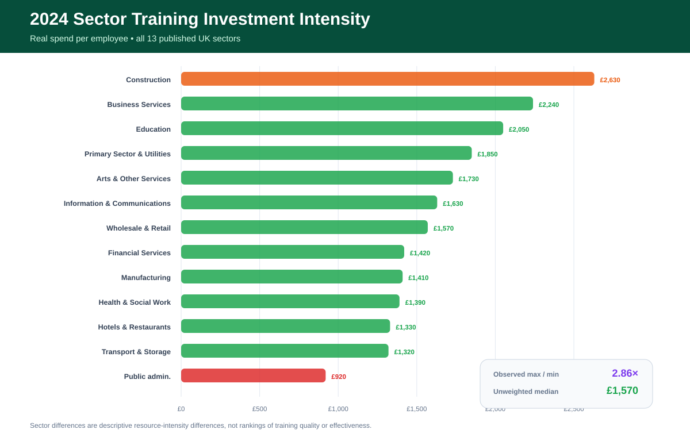
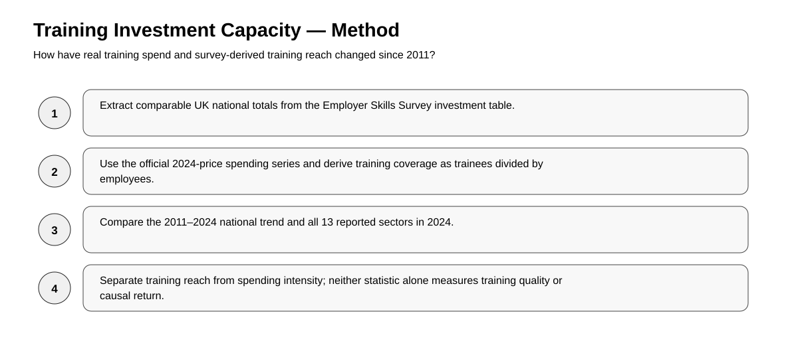
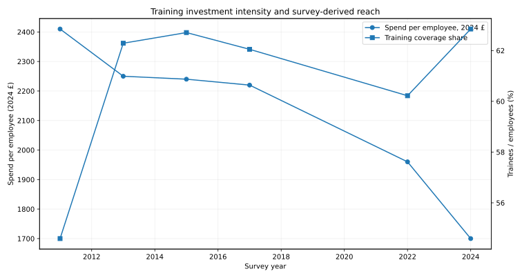
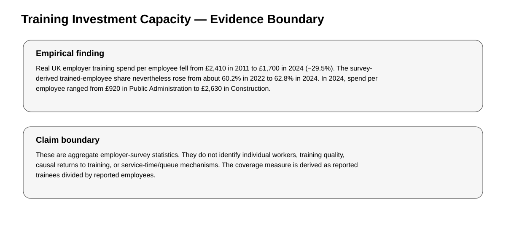

# Employer Training Investment Capacity: A Longitudinal UK Study

> **Empirical Research Bundle** · **Portfolio Track: Learning & Development Research** · Workforce Development / Training Investment / Official Statistics

Longitudinal empirical analysis of UK Employer Skills Survey training spend, coverage, and sector intensity from 2011 to 2024.



## Study status

**Completed secondary empirical analysis.** Reported findings were calculated from the named public source on 25 September 2026. The rebuild script contains **no synthetic fallback**. Raw source data are not republished unless source terms permit it; `data/source_manifest.json` records provenance, retrieval details, licensing notes, and the claim boundary.

## Research question

> How have real employer training investment intensity and training reach changed over time, and how heterogeneous is 2024 spending across sectors?

## Design

- **Design:** Secondary analysis of repeated cross-sectional official UK employer statistics
- **Source:** UK Employer Skills Survey 2024 — Investment in Training
- **Source page:** https://explore-education-statistics.service.gov.uk/find-statistics/employer-skills-survey/2024
- **Direct data endpoint:** `https://explore-education-statistics.service.gov.uk/data-catalogue/data-set/a07479d1-e26d-4b66-9ec9-e683917c1388/csv`
- **Retrieval / analysis date:** 2026-09-25
- **Licensing / reuse note:** UK government statistical data; reuse is subject to the source service and Open Government Licence terms.

## Hypotheses

1. H1: real training spend per employee in 2024 is below its 2011 level.
2. H2: 2024 training investment intensity varies substantially across sectors.
3. H3: training reach can increase even while real expenditure per employee declines.

## Empirical method

Extract United Kingdom national totals for comparable survey years, use the source’s 2024-price expenditure series, compute trainees divided by employees as the survey-derived training coverage share, and compare 2024 sector-level spend per employee and per trainee.



## Headline empirical finding

Real UK employer training spend per employee fell from £2,410 in 2011 to £1,700 in 2024 (−29.5%). The survey-derived trained-employee share nevertheless rose from about 60.2% in 2022 to 62.8% in 2024. In 2024, spend per employee ranged from £920 in Public Administration to £2,630 in Construction.

### Headline metrics

- **uk per employee 2011 gbp 2024 prices**: 2410
- **uk per employee 2024 gbp**: 1700
- **real change pct 2011 2024**: -29.46
- **uk total training 2011 bn 2024 prices**: 65.06
- **uk total training 2024 bn**: 53.0
- **employees trained 2024 m**: 19.584
- **highest sector 2024**: Construction
- **highest sector per employee 2024**: 2630
- **lowest sector 2024**: Public admin.
- **lowest sector per employee 2024**: 920
- **training coverage share 2022**: 0.6022
- **training coverage share 2024**: 0.6285
- **coverage change pp 2022 2024**: 2.63

The packaged derived tables are documented in `docs/data_dictionary.md`. That document states explicitly whether each CSV is a complete analysis table or a diagnostic subset.



## What this study can and cannot claim

**Can claim:** the computations in this repository summarize the named public dataset under the documented operationalization.

**Cannot claim:** These are aggregate employer-survey statistics. They do not identify individual workers, training quality, causal returns to training, or service-time/queue mechanisms. The coverage measure is derived as reported trainees divided by reported employees.



## Reproduce

Offline verification of packaged empirical results:

```bash
python -m pip install -r requirements.txt
pytest -q
python run_demo.py
```

Recompute the empirical analysis from the public source (internet required):

```bash
python scripts/fetch_and_analyze.py
```

The online rebuild calls study-specific functions from `research/model.py`; the tests exercise those functions and scientific invariants rather than only checking file presence.

## Research bundle contents

- `README.md` — study overview and bounded findings
- `EMPIRICAL_STUDY.md` — protocol, validity, and interpretation
- `data/source_manifest.json` — provenance, license note, and claim boundary
- `data/derived/` — compact derived empirical tables
- `results/empirical_summary.json` — machine-readable headline results
- `scripts/fetch_and_analyze.py` — public-source rebuild
- `research/model.py` — reusable study-specific analysis functions
- `tests/` — behavioral and scientific-invariant tests
- `docs/` — analysis plan, data dictionary, paper blueprint, references, originality map
- `assets/` — four study-specific SVG figures

## Research integrity

This bundle distinguishes **source data**, **operationalization**, **result**, and **interpretation**. The analysis plan documents the released analysis; it is **not described as preregistered**. Public data do not automatically validate a construct, so proxy and external-validity limits are explicit.
